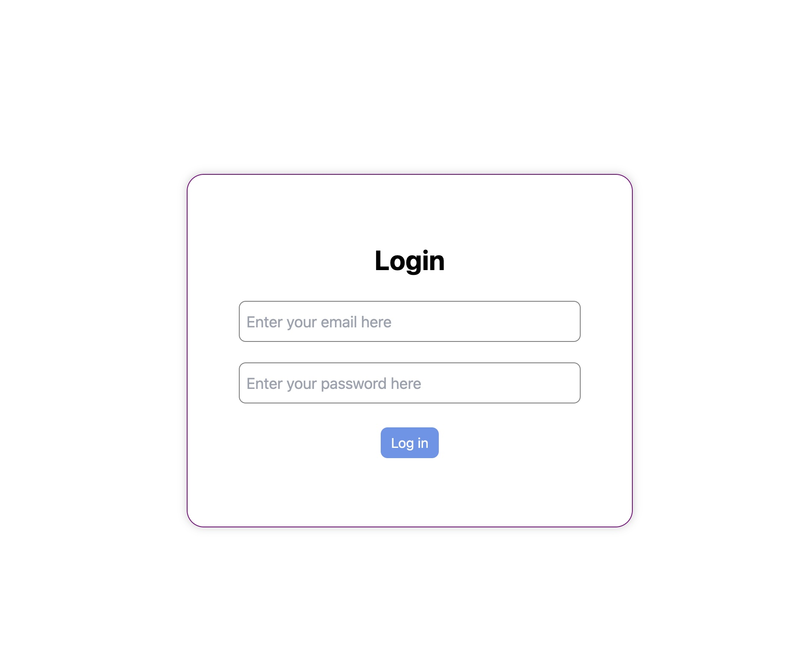
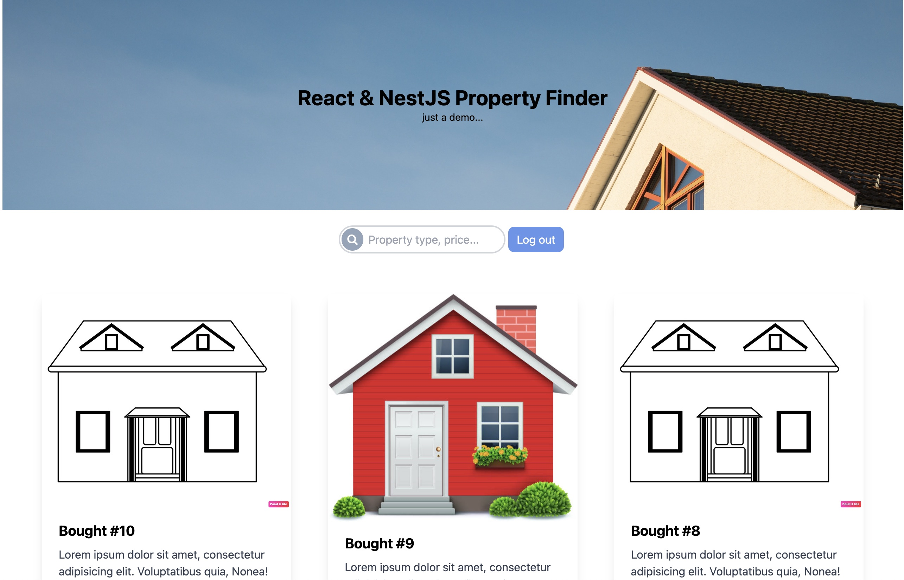
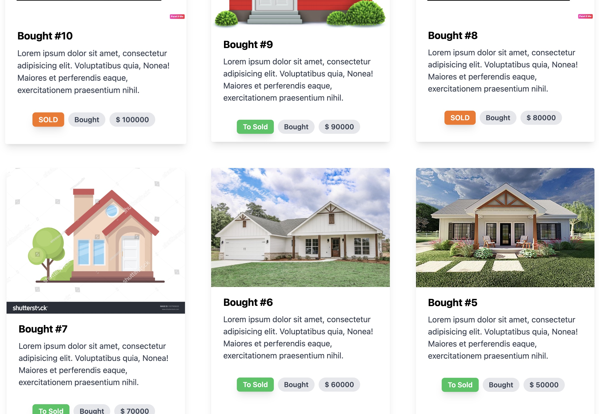

## SPS
> A full stack real estate web application , whith NestJS, ReactJS and MongoDB

## Features

1. FE with react in Typescript
    - tailwind
    - login page with protected routes
    - real authentication using credentials and jwt
    - listing page with search bar (type in search bar a price/property type to filter the results on the screen)
    - Infinite scroll as pagination
    - auto logout after token expiration

2. BE with nestJS in Typescript
   - authentication using JWT
   - REST API routes and guarded routes
   - Connection on online MondoDB
   
3. Mongo db
    - local DB using docker
    - remote DB with Atlas 

## Left over

1. I used RESTApi instead of graphQL

## Reasons Behind Technical Choices
1. I invest a lot of time searching some houses pictures and host them online somewhere, and DB is hosted in Atlas in free account (only one user connection allowed)
2. Password is not encrypted, I passed it as clear text in the API, thing that I won't do in Prod level, this is a shortcut for the demo.
3. I used context instead of normal state management (redux, zustand....).
4. No cache management and ahead of time pictures loading
5. I did some shortcut in FE implementation in sync. between FE and BE (I would have use something most robust like Redux toolKit or TanStack Query for Production level project...)

## Installation

### local Mongo
1. docker pull mongo:latest
2. docker run -d --name mongodb -p 27017:27017 mongo
3. docker ps
4. docker exec –it mongodb mongosh
5. db.runCommand({hello:1})
   
### Online mongo
1. I use the free plan of mongo atlas which allows **only one IP, -->so please send me your IP<--** to allow connection to the DB
   
### FE
1. make sure you run with node 18 and above
2. git clone git@github.com:ah584d/sps-homework.git
3. cd fe
4. npm ci
5. npm run dev
6. open "http://localhost:5173/"

### BE
1. cd be
2. npm ci
3. npm run start:dev

## REST API routes
### non protected routes
1. POST http://localhost:3001/auth/login
2. POST http://localhost:3001/property
3. POST http://localhost:3001/user

### protected routes
1. GET http://localhost:3001/user
2. GET http://localhost:3001/user/:id
3. GET http://localhost:3001/user/email/:email
4. GET http://localhost:3001/property
5. GET http://localhost:3001/property/:id>
5. GET http://localhost:3001/property/user/:id/:pageIndex
4. PUT http://localhost:3001/property/:id

## Users for demo

1. demo@sps.com/my_pass
2. demo2@sps.com/my_pass
3. demo3@sps.com/my_pass
4. admin@sps.com/my_pass

## Screenshots

